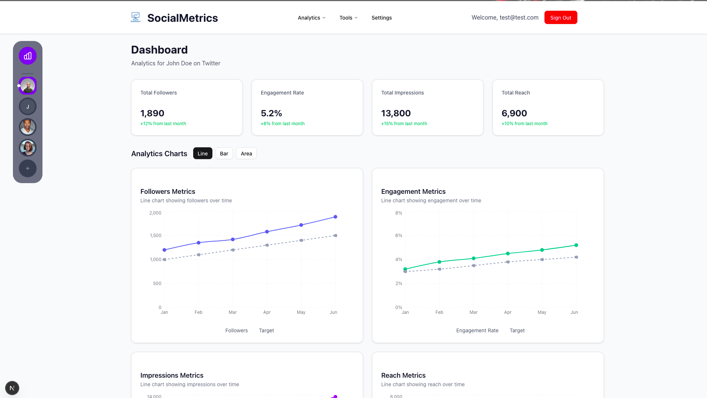

# SocialMetrics (WIP)

  
  
  **Comprehensive Social Media Analytics & Insights Platform**
  
  *Empower your social media strategy with data-driven insights and powerful analytics tools*

---

## What is SocialMetrics?

SocialMetrics is a modern, comprehensive social media analytics platform designed to help businesses, influencers, and marketers optimize their social media presence across multiple platforms. Built with Next.js and TypeScript, it provides real-time insights, performance tracking, and actionable analytics to grow your online presence.

---

## Key Features

###  **Analytics & Reporting**
- **Multi-Platform Dashboard** - Unified view of all your social media accounts
- **Real-Time Metrics** - Live tracking of followers, engagement, impressions, and reach
- **Interactive Charts** - Dynamic visualizations with line, bar, and area chart options
- **Performance Insights** - Detailed analysis of content performance and audience behavior
- **Custom Reports** - Generate comprehensive reports for stakeholders

### **Content Management**
- **Content Scheduler** - Plan and schedule posts across multiple platforms
- **Performance Tracking** - Monitor how your content performs over time
- **Engagement Analytics** - Track likes, comments, shares, and other interactions
- **Hashtag Analysis** - Optimize your hashtag strategy with performance data

### **Audience Intelligence**
- **Audience Demographics** - Understand your followers' age, location, and interests
- **Growth Tracking** - Monitor follower growth patterns and trends
- **Engagement Patterns** - Identify when your audience is most active
- **Competitor Analysis** - Benchmark against competitors in your industry

## 🛠️ Technology Stack

- **Frontend**: Next.js 14, React 18, TypeScript
- **Styling**: Tailwind CSS, shadcn/ui components
- **Charts**: Recharts for data visualization
- **Icons**: React Icons, Lucide React
- **State Management**: React Hooks
- **Authentication**: Supabase
- **Database**: Supabase

## Platforms to be Supported

- **Twitter/X** - Tweets, followers, engagement metrics
- **Instagram** - Posts, stories, reels analytics
- **LinkedIn** - Professional network insights
- **Facebook** - Page analytics and audience insights
- **TikTok** - Video performance and trending analysis *
- **YouTube** - Channel analytics and video metrics *

## Checklist

### Core Features
- [ ] User authentication system
- [ ] Database integration (Supabase/PostgreSQL)
- [ ] Social media API integrations
- [ ] Real-time data fetching
- [ ] User profile management
- [ ] Team collaboration features

### Dashboard Features
- [ ] Advanced filtering options
- [ ] Custom date range selection
- [ ] Export functionality (PDF/CSV)
- [ ] Automated report generation
- [ ] Goal setting and tracking
- [ ] Comparative analysis tools

### Content Management
- [ ] Content calendar view
- [ ] Bulk upload functionality
- [ ] Content templates
- [ ] Auto-posting features
- [ ] Content performance predictions

### Overall UI/UX Improvements
- [ ] Dark mode toggle
- [ ] Accessibility improvements
- [ ] Loading states and animations
- [ ] Error handling and user feedback

## Updates

**Dashboard**:
Version 1:
  